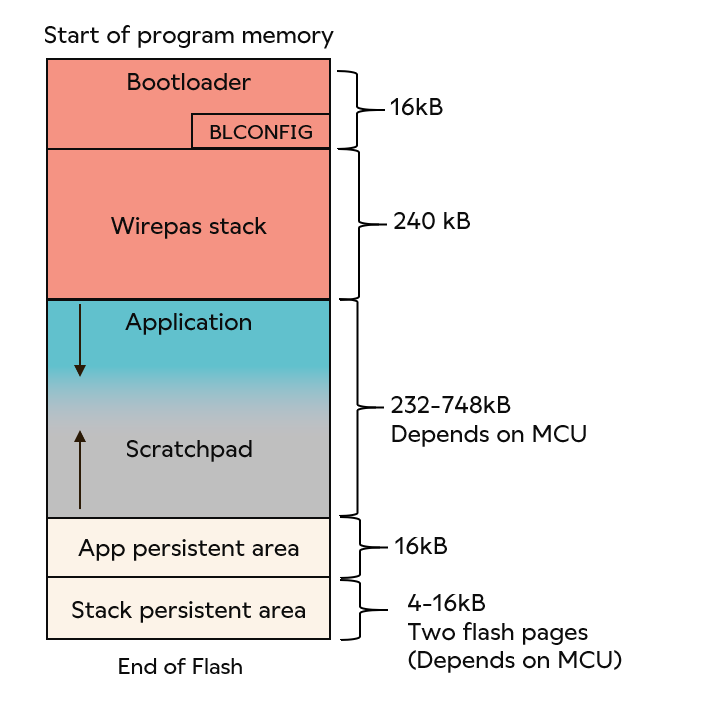
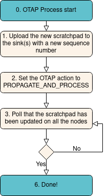

# Otap config and info

Here we describe the information on the OTAP functionality, and things to keep in mind, from my prespective (Romà Masana) while developping the gateway.

Table of contents
- [Otap config and info](#otap-config-and-info)
  - [General OTAP information](#general-otap-information)
    - [Notes for node](#notes-for-node)
    - [Area ID](#area-id)
    - [Boatloader](#boatloader)
    - [Scratchpad](#scratchpad)
    - [Sequence number](#sequence-number)
  - [Internal memory and Boatloader](#internal-memory-and-boatloader)
    - [Notes for node](#notes-for-node-1)
  - [How to perform OTAP with gateway](#how-to-perform-otap-with-gateway)
  - [How to use the otap scripts](#how-to-use-the-otap-scripts)
    - [Get the scratchpad status](#get-the-scratchpad-status)
    - [List sinks](#list-sinks)
    - [Discover nodes](#discover-nodes)
    - [Set a sink node adress and channel](#set-a-sink-node-adress-and-channel)
    - [Upload a scratchpad to a sink(s)](#upload-a-scratchpad-to-a-sinks)
    - [Propagate and process scratchpad](#propagate-and-process-scratchpad)
  - [Smartec tool for OTAP configuration](#smartec-tool-for-otap-configuration)
    - [Examples](#examples)
    - [Update all nodes in one python command](#update-all-nodes-in-one-python-command)

## General OTAP information

As described in the file *otap.py*, some general information on how OTAP works:

This file is responsible for updating the mesh network node software, via OTAP operations. 
- A good description of how OTAP works can be found here: https://developer.wirepas.com/support/solutions/articles/77000496639-wirepas-massive-otap-application-note
- tutorial on how to otap nodes -> https://developer.wirepas.com/support/solutions/articles/77000498371-how-to-perform-otap-with-wirepas-massive-v5-1 
- How a node bootloader and flash memory work -> https://developer.wirepas.com/support/solutions/articles/77000496582-wirepas-massive-flash-structure-and-bootloader-application-note

Steps for updating the node software:
    1. **Propagate** to spread a new update image (called a Scratchpad) to all devices in a given network
    2. **Trigger**: to send an update command to a network
    3. **Process** and apply the Update: When all devices process the update image and move to the new version

Node software that can be updating with the OTAP algorithm:
    1. Wirepas stack 
    2. Application sitting in the same radio chipset.
    3. Other user memory areas

Download Wirepas SKD: > https://developer.wirepas.com/support/solutions/articles/77000435375

### Notes for node
 1. In order for the OTAP to operate **some flash memory must be reserved** in each device to store the update image called Scratchpad.
 2. normal network operations are **disrupted** during the update process.

### Area ID 
Identifier for the firmware to update. Can either be:
    1. Wirepas stack firmware AreaID (*Stack AreaID*): The Area ID is always the same for all devices having the same chipset
    2. Application Area ID (*AppAreaID*): Each application area shall have a unique 32-bit AreaID that is stored in the device’s memory. 
        It shall be different for all different application firmware areas. **AreaID’s cannot be changed afterward the firmware build process**
    3. User-defined Area ID, that can also be defined to store specific data related to the user application or system and which can be updated via the Wirepas OTAP mechanism. 
        It has the same properties as the *application area ID*
Can be an **int**?

### Boatloader 
Whenever a new OTAP scratchpad is found in memory, the bootloader authenticates it and iterates through the OTAP files (see Scratchpad). 
If any of the data files have a matching AreaID, the bootloader erases the referenced memory areas and then writes file contents there.


    
### Scratchpad
An OTAP Scratchpad is binary data that gets copied from one node to another. A scratchpad is a collection of binaries transmitted via the OTAP. Each binary in a scratchpad has (among others) an Identifier to define the targeted component to be updated. This identifier is called AreaID and is a specific software component (a specific area in Flash memory to be accurate). It is a **binary file**?

The scratchpad is stored in the same memory region as the application. It means that the maximum size of the scratchpad a device can store will depend on the application size. The scratchpad area shall be large enough to store an OTAP image. In case of an heterogenous network, the nodes having the smallest memory footprint are the limiting one for OTAP. It is highly recommended to ensure that the available smallest scratchpad area still allows to store any scratchpad to ensure proper OTAP.

### Sequence number
Version of the scratchpad. Stored in 1 byte, its value is 1-254. The latest OTAP scratchpad gets copied between nodes until all nodes have the same scratchpad sequence number. It is an **int**?

## Internal memory and Boatloader

It is composed as in the image below: 
 <figure style="margin-left:auto;display:block;margin-right:auto;width:35%;">
  
  <figcaption>Flash memory and boatloader.</figcaption>
</figure> 

### Notes for node
Up to 8 areas can be defined in the bootloader. They are defined and can be modified in the SDK. And they are stored inside the BLCONFIG when the device is flashed. This means that once flashed, it is not possible to modify the area list defined in a device for the lifetime of the product.
BLCONFIG is generated at compile-time and can’t be modified after the device has been programmed
**BLCONFIG**: Located at the end of the bootloader and contains its configuration (areas descriptions and OTAP keys).


## How to perform OTAP with gateway

For what I read, the gateway has 2 ways of doing it:

1. With a Remote API, a continuous signal is sent to node after node, and if a node is not connected in that momment to the network, she misses the update
2. Using the **Network Persistent Data** (I don't know what this refers to), in this way, even nodes that are not always connected to the network, will eventually receive the update.

The general steps of how the OTAP flow is rolled-out is the following:

1. Update the nodes with the new software/*scratchpad*.
   1. Give them the scratchpad to the *sinks* using the function *WirepassNetworkInterface.upload_scratchpad()*
   2. Propagate and make the nodes process it and update their own software using the function *WirepassNetworkInterface.upload_scratchpad()* with *action=PROPAGATE_AND_PROCESS* or 3.
   3. Wait for all nodes to have updated their firmware. We can check when this is done, by running the function *Remote API MSAP Scratchpad Status requests* which is this one: **wirepas_otap_helper.send_remote_scratchpad_status()**
   4. Finally restart all gateway services. Restarting the sink after the propagate and process of the scratchpad is not enough. I just did all otap process but the nodes now don't respond to the gateway. It is necessary to restart:
      1. **the transport, sink and bus services**
      2. Additionally, I restarted the **mosquitto** broker and the **python gw backend script**.
   5. If you want to upload a new scratchpad, either make sure the *sequence number* in the python script increments (else the sink won't upload a scratchpad with a lower sequence number than the one it actually as) or set the sink to *no otap* which means destroy the current scratchpad.

 <figure style="margin-left:auto;display:block;margin-right:auto;width:50%;">
  
  <figcaption >OTAP roll-out on the mesh network.</figcaption>
</figure> 

## How to use the otap scripts

We can find all the python scripts for running an otap, at the *wirepass_mqtt_library* repository found in *https://github.com/wirepas/wirepas-mqtt-library/blob/main/examples/example_configure_sink.py*

### Get the scratchpad status

In particular, there is an example script on how to get the **scratchpad status**. In order to do so, we canm run the following command:

```
usage: example_get_remote_scratchpad_status.py [-h] [--host HOST] [--port PORT]
                                               [--username USERNAME] [--password PASSWORD]
                                               [--insecure] [--network NETWORK]

options:
  -h, --help           show this help message and exit
  --host HOST          MQTT broker address
  --port PORT          MQTT broker port
  --username USERNAME  MQTT broker username
  --password PASSWORD  MQTT broker password
  --insecure           MQTT use unsecured connection
  --network NETWORK    Network address concerned by scratchpad
```

In my case it was:

```
python3 example_get_remote_scratchpad_status.py --host 127.0.0.1 --port 1883 --username "roma_masana"  --password "all_I_want_for_christmas_is_you" --insecure --network 5
```

Then a prompt appears and you can either input *l* (list all node scratchpad status), *s*(send remote status)  or *e* (exit).

and after executing the *l* command many times, I manage to get following information on my nodes:

```
List of nodes:
    0 |  921134059 | 2023-03-06 10:26:26.816000 | {'ts': 1678098386816, 'seq': 2, 'crc': 55801, 'length': 26336, 'type': 2, 'status': 4, 'stack_version': (5, 3, 0, 89), 'stack_area_id': 262, 'app_version': (1, 1, 1, 0), 'app_area_id': 2364308230, 'action': 2, 'target_crc': 55801, 'target_seq': 2, 'target_delay_m': 0, 'remaining_delay_m': 0}
```

This information is described in **wirepas_otap_helper.get_current_nodes_status()**

I didn't manage to obtain any output after running *s* many times.

**Note** in the `otap_menu.py` this would mean executing option **8** and following the successive insctructions on screen.

### List sinks

Just run 

```
python3 example_list_sinks.py --host 127.0.0.1 --port 1883 --username "roma_masana"  --password "all_I_want_for_christmas_is_you" --insecure
```

And then I obtain a list of the connected sinks

```
2023-03-06 11:56:58.754451
[193853683731279:sink0] 
```
**Note** in the `otap_menu.py` this would mean executing option **8** and following the successive insctructions on screen.

### Discover nodes

I run the following command: 

```
python3 example_discover_nodes.py --host 127.0.0.1 --port 1883 --username "roma_masana"  --password "all_I_want_for_christmas_is_you" --insecure --network 5 --delay 10
```

Which waits for 10 seconds to listen to some node. And then lists the one he found:

```
In 10 s, 2 nodes were found in network 0x5
{1, 921134059}
```
**Note** in the `otap_menu.py` this would mean executing option **8** and following the successive insctructions on screen.

### Set a sink node adress and channel

**Warning:** This functionality NOT ONLY changes the *sink node channel* but also other sink settings such as - network *network address*, *sink state(started or not)*, *source* and *destination endpoints*. In order to change the network channel and address, you have to alter the file *example_sink_config.py*. The source and destination endpoints, cannot be changed.

I run a command like this one 

```
python3 example_sink_config.py --host 127.0.0.1 --port 1883 --username "roma_masana"  --password "all_I_want_for_christmas_is_you" --insecure --network 5
```

after setting this line on the script *example_sink_config.py*:

```
res = wni.set_sink_config(gw, sink, {"network_channel": 5, "network_address": 5, "started":True})
```

and I obtained the following output:

```
INFO 2023-03-06 16:25:50,874 ..Connected to MQTT
Set new config to 2482682449232:sink0
Cannot set new config to 2482682449232:sink0
All done
```

This will take the network with address 5, and depending on what you wrote in your script *example_sink_config.py* it will change some of its parameters. 

After this, it is recommended to unplug and plug the sink to the gateway device.

**NOTES**: 
1. For doing this, there is an equivalent file called *example_configure_sink.py* that you can also use and pass the new sink configuration like we did in this script.
2. When changing *anything* in sink config, it is expected that the sink restarts. On linux, on boot, the sink dbus USB port can change names, thus invalidating the service start set up in the docker-compose file, where the USB address was AMC1 and now it could randomly change to AMC0. To see how we solved this uncertaingy in the *dbus name* and understand the problem better, you can read -> https://www.reddit.com/r/homeassistant/comments/ak49qg/docker_tip_best_way_to_access_usb_serial_devices/ 
This actually doesn't work. It is better to write 2 docker-compose files, one with each serial port, and then check which one is active and run the corresponding docker-file.


### Upload a scratchpad to a sink(s)

You can use the example file *example_otap.py*. And perform the following command:

```
python3 example_otap.py upload_only --host 127.0.0.1 --port 1883 --username "roma_masana"  --password "all_I_want_for_christmas_is_you" --insecure --network 5 --file ../scratchpads/otap-1LED_wpc_stack.otap
```

After this your terminal should obtain:

```
Sequences already in used:  {2}
Sequence chosen:  3
Scratchpad uploaded to all sink(s)!
```

And your sink terminal logs:

```
transport-service    | 2023-03-07 09:50:18,105 | [INFO] wirepas_gateway@transport_service.py:647:OTAP upload request received for sink0
sink-service         | 2023-03-07 09:50:18,484 | [DEBUG] Otap:Upload scratchpad: with seq 3 of size 117360
sink-service         | 2023-03-07 09:50:19,105 | [INFO] msap:Start scratchpad request result = 0x00
transport-service    | 2023-03-07 09:50:21,685 | [INFO] wirepas_gateway@sink_manager.py:422:Scratchpad loaded with seq 3 on sink sink0
```

**Note** in the `otap_menu.py` this would mean executing option **6** and following the successive insctructions on screen.

### Propagate and process scratchpad

For that we can simply execute

```
python3 example_otap.py immediately --host 127.0.0.1 --port 1883 --username "roma_masana"  --password "all_I_want_for_christmas_is_you" --insecure --network 5 
```

Once I run this, I had to wait a few minutes. 

When I wanted to know if the nodes were finally updated, I run the *get scratchpad status* command to see if the scratchpad of the nodes was the old one, or the one we just sent.

Once all the nodes have the latest *sequence number* we can restart/reboot the sink, if this is not done automatically already.

After that, all should be ready and the nodes should have the new firmware.

The sink logs will display some errors as these ones, for a while:

```
sink-service         | 2023-03-21 08:12:23,510 | [ERROR] wpc_int:Didn't receive answer to the request 0x04
sink-service         | 2023-03-21 08:12:23,510 | [ERROR] wpc_int:No poll answer
```

In particular, it will show it around 20 times in a row, then it will start showing this warning another 20 times:

```
sink-service         | 2023-03-21 08:12:50,922 | [WARNING] wpc_int:Waiting confirm for frame_id 0xb5 but received 0xb1
```
And then it will repeat this sequence of error and warning another time.

And after receiving the errors and warnings 2 times, the nodes are updated with the new scratchpad. You can check it by listing the current scratchpads.

**Note** in the `otap_menu.py` this would mean executing just option **8**

## Smartec tool for OTAP configuration

We developped an easy to use python script to perform all of the above in the easiest way. Just run 
```
python3 otap_menu.py
```

And you will be shown with the 8 different otap functionalities. You will have to provide the `network channel` and depending on the otap mode selected, also the `scratchpad` or other arguments.

All the scripts explained in the previous section will be called by this main file, and the MQTT broker credentials used are the `local broker` credentials stored in the file `mqtt_credentials.py`.

This is an example of what you should see when you run the `otap_menu.py` file:
```
python3 otap_menu.py 

***********************************************************************
* WARNING:
*     You are using the pure python protobuf implementation.
*     For better results, please consider using the cpp version.
*     For more information please consult:
*     https://github.com/protocolbuffers/protobuf/tree/master/python
***********************************************************************

select an otap operation to perform:
1: Propagate only
2: Propagate and process immediately
3: Set propagate and process with 5 days delay
4: Change time delay to 30 minutes
5: Set sink(s) to no otap
6: Upload scratchpad to all sinks
7: Process scratchpad on all sink(s)
8: Display sink status and scratchpad status on all nodes
choose one mode from above:_
```
### Examples

5. **Setting no otap to all sinks**: (*this is useful when we don't want the nodes to automatically update with the sink's firmware*) If we select for instance option 5, this is what we should observe after the initial menu is displayed:

```
...
choose one mode from above: 5
mode 'Set sink(s) to no otap' selected
Input a target network to affect:
5
Sequences already in use:  {0}
Sequence chosen:  1
Setting target to no otap
No-otap set for all sinks

```

### Update all nodes in one python command

The script `otap_update_all_nodes.py` needs:
- a scratchpad
- network address

And then it:
1. sets the sink to *no otap* mode to erase any possibly conflicting scratchpad already loaded in the sink memory
2. updates the scratchpad
3. if everything is ok it processes and propagates the scratchpad
4. it waits
5. then if everything is ok, it ends.


